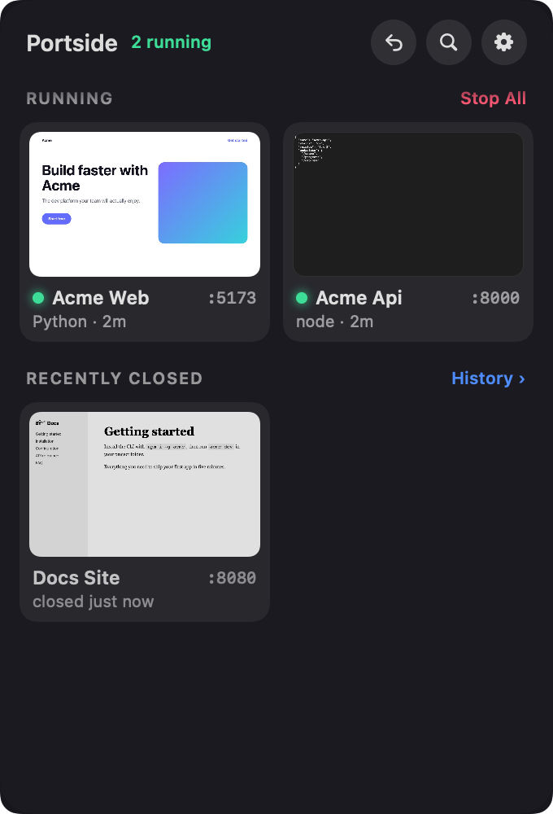
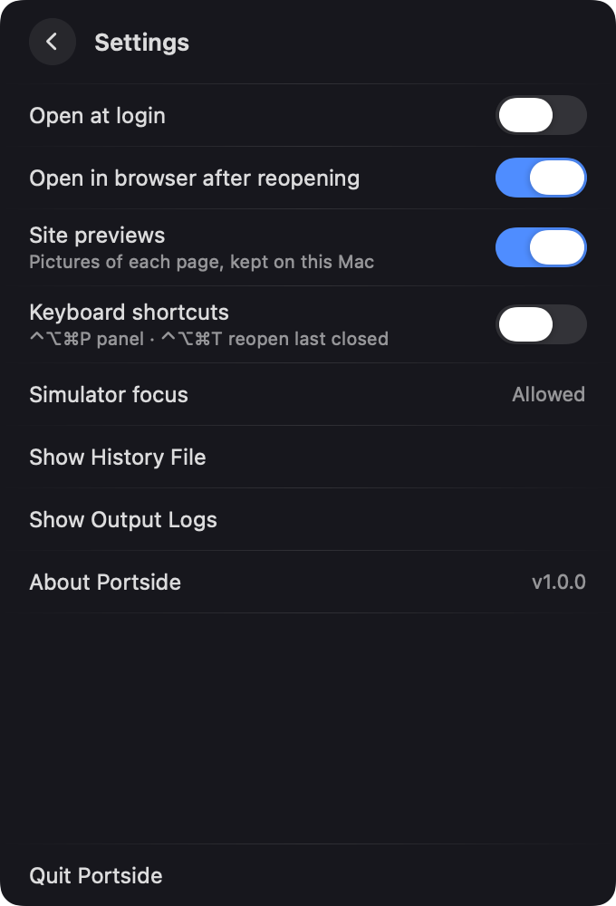

# Portside

🇹🇷 [Türkçe README](README.tr.md)

**Your local dev servers, with a memory.** Portside is a small, free and open-source macOS menu bar app that shows every dev server running on your Mac, and remembers each one after it stops. Closed a terminal by mistake? Rebooted? One click starts the server again, with the same command, folder and environment it ran with before.

<p align="center">
  <a href="../../releases/latest"></a>
  
  
</p>

<p align="center">
  
  &nbsp;
  
</p>

## Features

- **Running servers as cards, with a preview of each page.** Port, project name, framework (Next.js, Vite, Nuxt, Remix, Astro, Django, Flask, FastAPI, Rails, Go, Cargo, PHP, plain Python and more) and how long each one has been up. Click a card to open it in the browser.
- **Recently Closed.** When a server stops, for whatever reason, its card turns grey and stays, showing the last picture of its page so you recognise it. Click it to start the server again; Portside opens it in your browser once it is listening.
- **A menu bar icon that counts.** A small browser window with the number of running servers inside. The number rolls when it changes, counts up when you point at it, and a loading bar runs while a server is starting.
- **Liquid Glass panel** on macOS 26 and later.
- **Reopen the last closed server** with the ↩ button, or with ⌃⌥⌘T from anywhere (optional shortcut).
- **History** of every server Portside has seen: grouped by day and searchable by project, port or command. Keeps up to 200 servers; pinned ones never age out.
- **Pin** the servers you start every day so they stay at the top.
- **Restart and stop** running servers. Stop takes down the whole process tree (npm → sh → node → next-server), not just the process holding the port.
- **Edit Command…** when the detected command isn't what you want, such as `npm run dev` instead of the raw `node …` call. Your command runs in the project folder through your login shell, as it would in Terminal.
- **Failures explained in place.** If a server doesn't come back, the row shows the relevant lines of its output, with the full log one click away.
- **Servers outlive Portside.** Servers started by Portside write to a log file, not a pipe, so quitting Portside doesn't take them down.
- **Hide projects** you don't want to see (a background API, a docs server…).
- **iOS Simulators:** booted simulators with the app running inside; relaunch the app or shut the simulator down.
- **Quick actions** on right-click: Show in Finder, Open in Terminal, Copy Address, Copy Command, Open Output Log.
- English and Türkçe; Portside follows your macOS language.

## Install

1. Download `Portside-x.y.z.dmg` from the [latest release](../../releases/latest).
2. Open it and drag **Portside** to **Applications**.
3. Open Portside. A small window icon appears in the menu bar and the panel opens once to show you where it lives.

Releases are signed with a Developer ID and notarized by Apple. Portside runs on macOS 14 Sonoma or later, on Apple Silicon and Intel Macs.

> **First run:** if your projects live in Desktop, Documents or Downloads, macOS asks whether Portside may access that folder. Portside needs it to read a project's `package.json` for its name and to start servers inside that folder. Until you answer, those projects show their folder name.

## How it works

Portside checks every 3 seconds with standard macOS tools and APIs:

- **Listening ports:** `lsof -iTCP -sTCP:LISTEN`, filtered to dev runtimes (node, bun, deno, python, ruby, go, cargo, php, java, uvicorn, gunicorn, puma…). Databases and system services aren't listed.
- **The real command:** Next.js and npm overwrite their own process title, so the process holding a port often can't be started again from what `ps` shows. Portside reads the real arguments and binary from the kernel (`KERN_PROCARGS2`) and walks up the parent processes to the first one that can be launched again, without leaving the project folder. This part comes from Blink.
- **Environment:** the same kernel call gives the server's environment, so `PATH` and settings like `NODE_ENV` are restored when it starts again, even from a menu bar app with no shell.
- **Identity:** a server is identified by its folder and command, not its port. A Vite server that moved from 5173 to 5174 is still the same server.

## Privacy and what is stored

Portside has no analytics and talks to no server of its own. Everything stays on your Mac:

| What | Where |
|---|---|
| History (folder, command, environment, port, timestamps) | `~/Library/Application Support/Portside/history.json` (readable only by you, `0600`) |
| Output of servers Portside started | `~/Library/Logs/Portside/` |
| Page previews (small JPEGs) | `~/Library/Application Support/Portside/Previews/` |
| Settings, hidden projects | `UserDefaults` (`io.github.berkinefeavci.portside`) |

**Site previews** open each running server's page (`http://localhost:<port>`) in a hidden web view for a moment, the way a browser tab would. Pages that load fonts, scripts or analytics from the internet will do so then too. Turn previews off in Settings to stop this and delete the saved pictures.

Environment variables whose names look secret (containing `SECRET`, `TOKEN`, `PASSWORD`, `API_KEY`, `PRIVATE`, `CREDENTIAL`, `AUTH`, `COOKIE`, `SESSION`) are **never written** to the history file. A server that needs such a value from your shell (not from a `.env` file) may fail to reopen. Use **Edit Command…** to run it through your login shell, which loads your usual environment. See [PRIVACY.md](PRIVACY.md).

## Limitations

- Portside starts servers it has **seen running**. It doesn't scan your disk for projects.
- A server whose command couldn't be read shows "no command". Use **Edit Command…** to give it one.
- If a runtime is updated in place (for example a Homebrew Python upgrade that changes the versioned path), the saved binary may be gone. Portside says so, and **Edit Command…** fixes it.
- Docker containers, databases and other non-dev listeners are intentionally ignored.

## Build from source

Requires Xcode 26 or later (the app icon is an Icon Composer file; tests and `./build.sh --compile-only` work with Xcode 16).

```bash
git clone https://github.com/berkinefeavci/portside.git
cd portside
./check.sh              # unit tests + universal build + localization check
./build.sh --install    # builds dist/Portside.app, copies it to /Applications and opens it
```

`./release.sh` produces a Developer ID signed, notarized DMG (needs your own signing identity and a `notarytool` profile).

## Contributing

Issues and pull requests are welcome. See [CONTRIBUTING.md](CONTRIBUTING.md). For security problems, see [SECURITY.md](SECURITY.md).

## Credits

Portside is inspired by [Blink](https://github.com/megootronic/Blink) by mo.software and reuses parts of its code under the MIT License. See [THIRD_PARTY_NOTICES.md](THIRD_PARTY_NOTICES.md).

## License

[MIT](LICENSE) © 2026 Berkin Efe Avcı. Portside is free and will stay free.
