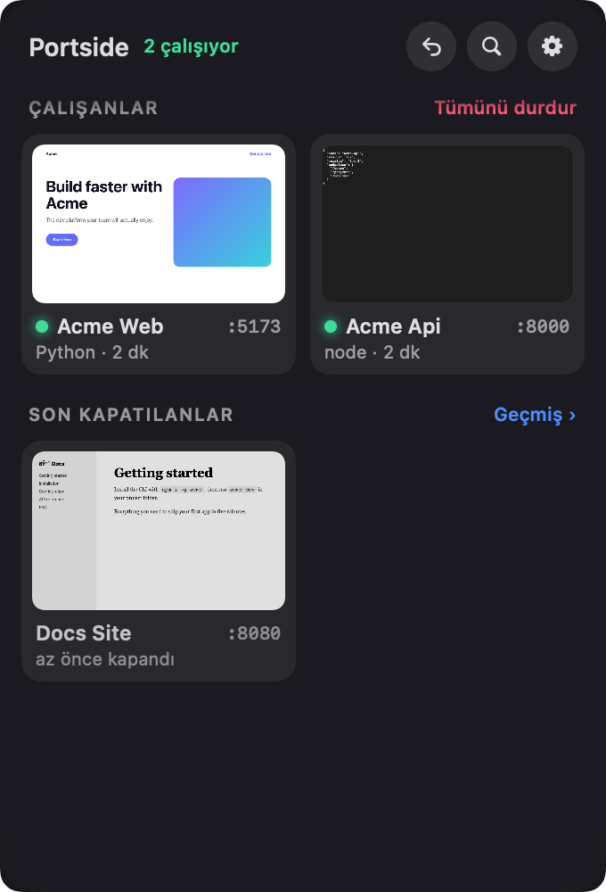

# Portside

🇬🇧 [English README](README.md)

**Yerel geliştirme sunucuların, hafızasıyla.** Portside, Mac'inde çalışan her geliştirme sunucusunu gösteren ve kapandıktan sonra da hatırlayan küçük, ücretsiz ve açık kaynak bir menü çubuğu uygulamasıdır. Terminali yanlışlıkla mı kapattın, Mac'i mi yeniden başlattın? Tek tıkla sunucu aynı komut, klasör ve ortamla yeniden başlar.

<p align="center">
  
</p>

## Özellikler

- **Önizlemeli kartlar:** her çalışan sunucu, sayfasının küçük görüntüsüyle bir kart: port, proje adı, çatı (Next.js, Vite, Django, FastAPI…) ve ne kadar süredir açık olduğu. Karta tıklayınca tarayıcıda açılır.
- **Son kapatılanlar:** kapanan sunucunun kartı griye döner ve sayfasının son görüntüsüyle kalır. Tıklayınca yeniden başlar; port dinlenmeye başlayınca tarayıcıda açılır.
- **Sayan menü çubuğu simgesi:** küçük bir pencere, içinde çalışan sunucu sayısı. Sayı değişince yuvarlanır, üstüne gelince sayar, sunucu açılırken yükleme çizgisi akar.
- **Liquid Glass panel** (macOS 26 ve sonrası).
- **Son kapatılanı aç:** başlıktaki ↩ düğmesi ya da her yerden ⌃⌥⌘T (isteğe bağlı kısayol).
- **Geçmiş:** gün gruplu, proje, port ya da komutla aranabilir. En fazla 200 sunucu tutulur; sabitlenenler hiç silinmez.
- **Sabitle:** her gün açtığın sunucular hep üstte durur.
- **Yeniden başlat ve durdur:** durdurmak yalnız portu tutan süreci değil, bütün süreç ağacını kapatır.
- **Komutu düzenle…:** algılanan komut istediğin gibi değilse (ör. `npm run dev` kullanmak istiyorsan) kendi komutunu yaz. Komut proje klasöründe, Terminal'deki gibi giriş kabuğunla çalışır.
- **Hata yerinde gösterilir:** sunucu açılamazsa satırda çıktısının ilgili kısmı görünür, tam kayıt tek tık uzakta.
- **Sunucular Portside'dan bağımsız yaşar:** Portside'ı kapatmak başlattığı sunucuları kapatmaz.
- **Projeyi gizle**, **iOS simülatörleri**, sağ tık menüsünde Finder / Terminal / adres ve komut kopyalama.
- İngilizce ve Türkçe; macOS diline uyar.

## Kurulum

1. [Son sürümden](../../releases/latest) `Portside-x.y.z.dmg` dosyasını indir.
2. Aç ve **Portside**'ı **Uygulamalar** klasörüne sürükle.
3. Portside'ı aç. Menü çubuğunda küçük bir pencere simgesi belirir; panel ilk açılışta bir kez kendiliğinden açılır.

Sürümler Developer ID ile imzalı ve Apple tarafından onaylıdır (notarized). macOS 14 Sonoma ve sonrası, Apple Silicon ve Intel.

> **İlk açılış:** Projelerin Masaüstü, Belgeler ya da İndirilenler'deyse macOS, Portside'ın o klasöre erişmesine izin isteyip istemediğini sorar. Proje adını `package.json`'dan okumak ve sunucuyu o klasörde başlatmak için gerekir.

## Gizlilik

Portside analiz verisi toplamaz, kendine ait hiçbir sunucuya bağlanmaz. **Site önizlemeleri** için her sunucunun yerel sayfasını gizli bir web görünümünde kısa süre açar; sayfa internetten yazı tipi ya da betik yüklüyorsa o an onları da yükler. Ayarlardan kapatılabilir. Geçmiş `~/Library/Application Support/Portside/history.json` dosyasında yalnız senin okuyabileceğin şekilde durur. Adında `SECRET`, `TOKEN`, `PASSWORD`, `API_KEY` gibi ifadeler geçen ortam değişkenleri **hiç kaydedilmez**. Ayrıntı: [PRIVACY.md](PRIVACY.md).

## Kaynaktan derleme

```bash
./check.sh              # testler + universal derleme + çeviri kontrolü
./build.sh --install    # dist/Portside.app'i derler, /Applications'a kopyalar ve açar
```

## Teşekkür ve lisans

[Blink](https://github.com/megootronic/Blink)'ten (mo.software, MIT) esinlenildi ve kodunun bir kısmı kullanıldı; bkz. [THIRD_PARTY_NOTICES.md](THIRD_PARTY_NOTICES.md).

[MIT](LICENSE) © 2026 Berkin Efe Avcı. Portside ücretsizdir ve ücretsiz kalacak.
